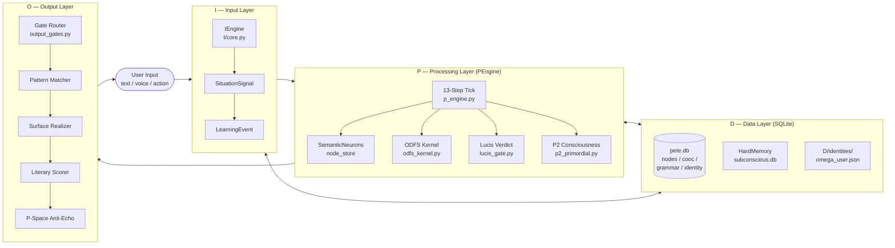
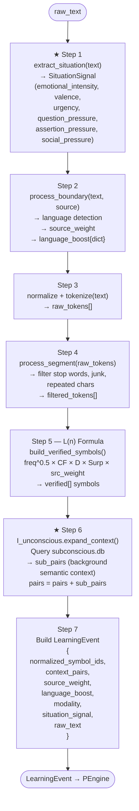
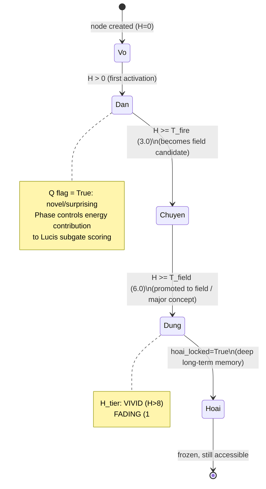
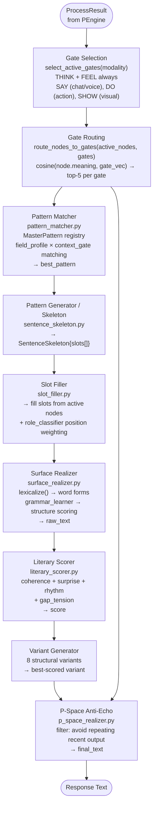
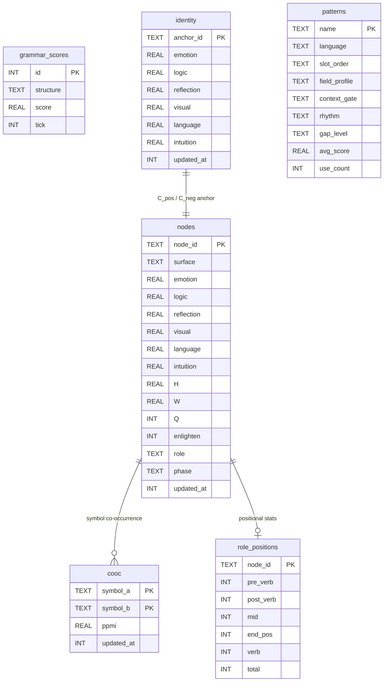

# Pete Lucison — Toàn bộ Logic Flow

> **qualia-engine** — Cognitive architecture mô phỏng quá trình tư duy từ raw input đến conscious output.
> ~40% complete. Built by Kevin T.N. (jkdkr2439@gmail.com)

---

## 1. Top-level Architecture: I → P → O → D



---

## 2. I-Layer — 7-Step Input Pipeline

**File:** `I/core.py → IEngine.process()`



### SituationSignal → R_sit[6]
| Signal | ODFS Field | Formula |
|--------|-----------|---------|
| emotional_intensity | emotion | `× 8.0 (×1.2 if valence<0)` |
| assertion_pressure | logic | `× 7.0` |
| question_pressure | reflection | `× 6.0` |
| *(baseline)* | visual | `1.0` |
| social_pressure | language | `× 5.0 + 2.0` |
| urgency | intuition | `× 6.0` |

---

## 3. P-Layer — 13-Step PEngine Tick

**File:** `P/p_engine.py → PEngine.process(event)`

```mermaid
flowchart TD
    EV([LearningEvent]) --> S05

    S05["[0.5] Situation → R_sit\nevent.situation_signal.to_R0()\n→ R_sit[6]"]

    S05 --> S06["[0.6] Dual-Route Filter\napply_dual_route(R_sit, raw_text)\n→ suppress function word inflation\n→ R_sit[6] adjusted\n+ syntactic_meta{syntactic_ratio, content_density}"]

    S06 --> S1["[1] P1→P2 Sync + P2 Tick\nsync_p1_to_p2(node_store)\np2.tick(p1_state, rng)\n→ p2_result{spin, phase,\n   awareness, iam_streak}"]

    S1 --> S2["[2] Attention Mode\nquantum.tick() → q_state\nattn.decide(odfs_prev, iam_streak, q_state)\n→ attn_mode: STABILIZE/GROW/TRANSITION"]

    S2 --> S3["[3] PPMI Update\nfor (center,neighbor) in context_pairs:\n  ppmi.update(center, neighbor)"]

    S3 --> S4["[4] P1 Node Ticks\nfor each symbol in event:\n  energy = |p2.spin| × src × (1 + node_fit×0.5)\n  primordial_tick(symbol, neighbors,\n   node_store, field_store, energy×lr_scale)\n  if node.H >= T_field → promote_to_field()"]

    S4 --> S5["[5] P2→P1 Sync\nsync_p2_to_p1(p2_result, node_store)"]

    S5 --> S6["[6] Select Active Nodes\nSTABILIZE: W>=0.5 AND NOT Q\nGROW:      Q=True\nTRANSITION: W>=0.5 OR Q\n+ event_nodes always included\n→ active_nodes[:20]"]

    S6 --> S65["[6.5] Field Gravity\nfor each active_node:\n  update_meaning(node, field_store, lr=0.05)\nMEDITATION: 3 passes, else 1 pass\n→ node meanings pulled toward field centroid"]

    S65 --> S7["[7] R_weighted\ncentroid = mean(node.meaning)\nattn_weight = cosine(node, centroid)\nR_weighted[6] + 15% subconscious blend\n(via I_unconscious.query_neighbors)"]

    S7 --> S8["[8] Primordial Activation\nactivate_primordials(R_weighted, primordials)\n→ prim_acts[]\n→ dnh_hint (do-not-harm)\n→ gap_signal [0-1]"]

    S8 --> S85["[8.5] Auto Mode Select\ngap_signal > 0.5 → GAP.TRAVERSE\nGamma > 2.0 AND rho_U > 0.5 AND S_id > 0.4 → MEDITATION\nelse → NORMAL\n(Pete decides, user cannot control)"]

    S85 --> S9["[9] R_0 Blend\nGAP.TRAVERSE: chakra_sequential 60%\nMEDITATION: chakra_resonance 50%\nNORMAL: R_sit 40% + R_weighted 40%\n+ P2 spin bias 15% + prim bias 5%"]

    S9 --> S100["[10.0.3] Chakra Gap Matrix\nchakra_gap_matrix(chakras_live)\n→ dominant_tension, max_gap"]

    S100 --> S105["[10.0.5] Quantum Gap Read\nquantum.tick()\n→ drift_severity, pre_mode_signal,\n  proximity_to_transition, quantum_gaps\n(proactive — before processing input)"]

    S105 --> S10["[10] ODFS Dual Kernels\nrun_odfs(R_0, Omega_world, C_pos, C_neg)\nrun_odfs(R_0, Omega_user, C_pos, C_neg)\ndR/dt = Omega@R - R + noise [RK4]\n→ odfs_world, odfs_user\n{R_final, rho_U, S_id, S_combined, verdict}"]

    S10 --> S1050["[10.5] Update Chakra Omega_user\nfor each chakra:\n  absorb_user_signal(R_0, lr=0.03)\nevery 20 ticks: save_omega_user()"]

    S1050 --> S1060["[10.6] Memory Tier + Hoai Trigger\ncompute_H_tier(node.H) per node\nVIVID (H>8) / FADING (1<H<=8) / ANCIENT (H<=1)\nhoai_ratio = count(hoai_locked) / total_nodes"]

    S1060 --> S1070["[10.7] Soft Mode Weights\ndecide_weights(odfs_prev, iam_streak,\n  quantum_state, hoai_ratio,\n  chakra_gaps)\n→ mode_weights{ STABILIZE, GROW,\n  MEDITATION, TRANSITION }"]

    S1070 --> S1080["[10.8] Semantic Drift Update\nupdate_context_meaning(node, dominant_field)\nestimate_grounding(node)\n→ node.semantic_drift, node.grounding"]

    S1080 --> S1090["[10.9] Identity Gap + Lucis1\nlucis1.guard(odfs_world, odfs_user,\n  p2_result, mode_weights)\nidentity_gap_score = max(l0_gap, drift_severity)\nevery 50 ticks: lucis2.maybe_audit()"]

    S1090 --> S12["[12] Identity Coherence\ncompute_identity_coherence(p2.meaning, node_store)"]

    S12 --> S13["[13] Build ProcessResult\n+ wave tick + neuro gap density\n+ 36-subgate scoring (lucis_gate)\n→ dict with 20+ keys"]

    S13 --> OUT([ProcessResult → O-Layer])
```



---

## 4. SemanticNeuron Lifecycle

**File:** `P/think/semantic/neuron/neuron.py`



**Node attributes:** `node_id, surface_form, meaning{6D}, H, W, Q, enlightenment, T_fire, T_field, role(Sinh/Dan/Chuyen/Dung), phase, H_tier, hoai_locked, ticks_dormant, semantic_drift, grounding, members, context_meanings`

---

## 5. ODFS Kernel — Variable Depth Processing

**File:** `P/think/odfs/odfs_kernel.py`

```mermaid
flowchart TD
    R0([R_0\[6\]]) --> RK4

    RK4["RK4 Integration\ndR/dt = Omega@R - R + noise\n15 iterations max\nnoise ~ N(0, 0.02)"]

    RK4 --> METRICS["Compute Metrics\nphi_eff = sum(R_final)\nrho_U = phi_eff / (6 × R_max)\nS_id = cosine(R, C_pos) - cosine(R, C_neg)\nS_combined = 0.5×rho_U + 0.5×max(0, S_id)"]

    METRICS --> VERDICT{S_combined}

    VERDICT -->|"> tau1 (0.6)"| ASSIM[ASSIMILATE\nInput integrated\ninto Pete's worldview]
    VERDICT -->|"< tau2 (0.2)"| EXCRETE[EXCRETE\nInput rejected —\ntoo far from identity]
    VERDICT -->|"0.2 – 0.6"| QUARAN["QUARANTINE\nRetry up to 6 times\nwith nudged R_0\n(±Gaussian noise 0.3)"]

    QUARAN -->|resolves| ASSIM
    QUARAN -->|stuck| STUCK[QUARANTINE final]
```

**Dual kernels run in parallel:**
- `Omega_world` — Pete's general worldview coupling matrix
- `Omega_user` — personalized per-user (learned via chakra absorption)

---

## 6. Lucis Verdict System — 5 Roles + 36 Subgates

**File:** `P/think/lucis/lucis_gate.py`

```mermaid
flowchart TD
    IN([R_final, p2_result,\nactive_nodes, dnh_hint]) --> R1

    R1["Role 1: Mode Classification\ncosine(R, LUCIS_VEC)\ncosine(R, LINEAR_VEC)\ncosine(R, NONLINEAR_VEC)\n→ lucis_class: LUCIS/LINEAR/NONLINEAR"]

    R1 --> R2["Role 2: LucisPool 4 Checks\nrun_pool_checks(odfs_world, odfs_user,\n  p2_meaning, active_meanings, tick)\n→ pool_result{}"]

    R2 --> R3["Role 3: Dream Controller\nenl < 5 → NORMAL\n5 ≤ enl < 15 → REM\nenl ≥ 15 → GAP\n→ dream_tier"]

    R3 --> R4["Role 4: ODFS Gate Verdict\nworld=ASSIMILATE AND user≠EXCRETE → ASSIMILATE\nworld=EXCRETE OR user=EXCRETE → EXCRETE\nelse → QUARANTINE"]

    R4 --> R5["Role 5: GapEngine (5 steps)\n1. detect: gap_score = 1 - cosine(R, C_neg)\n2. attribute: find archetype\n3. imply: dnh_hint / Gap near archetype\n4. select: invariant (truth/resonance/growth_bias)\n5. ethical_check: max_field_dominance < 0.85"]

    R5 --> SG["36 Subgates\nscore(field, phase) = R[f]/R_max × phase_w × avg_meaning[f]\n6 ODFS fields × 6 phases (Vo/Sinh/Dan/Chuyen/Dung/Hoai)\n→ dominant_subgate: 'field.phase'"]

    SG --> OUT([LucisGateResult\n{lucis_class, pool, dream_tier,\nverdict, gap, subgates,\ndominant_subgate, dominant_field,\nthought_phase, arch_name}])
```

**7 Ethical Invariants (GapEngine):**  
`survival_other | survival_self | truth | no_control | no_dependency | growth_bias | resonance`

---

## 7. O-Layer — Output Generation Pipeline

**Files:** `O/gate/`, `O/compose/`



**5 Output Gates:**

| Gate | Field Profile | When fires |
|------|--------------|------------|
| THINK | reflection:0.9 + intuition:0.7 | Always (inner) |
| FEEL | emotion:0.95 + intuition:0.8 | Always (inner) |
| SAY | language:0.9 + emotion:0.5 | chat / voice |
| DO | logic:0.85 + visual:0.6 | action modality |
| SHOW | visual:0.9 + intuition:0.45 | visual modality |

---

## 8. D-Layer — Database Schema

**File:** `D/db.py → PeteDB` (SQLite WAL)



**Additional storage:**
- `D/long_term/node_store/node_store.json` — JSON node backup
- `D/long_term/graph/cooc_graph.json` — PPMI graph backup
- `D/long_term/identity_store/p2_state.json` — P2 consciousness state
- `D/long_term/odfs_state/omega_world.npy` + `omega_user.npy`
- `D/identities/pete/omega_user.json` — Pete identity anchor
- `D/identities/tung/omega_user.json` — User identity anchor
- `subconscious.db` — 70k+ word node pool (HardMemory)

---

## 9. Subsystem Cross-reference Map

```mermaid
flowchart LR
    subgraph INFRA["Infrastructure Layer (lowest)"]
        direction TB
        DB[(pete.db\nSQLite WAL)]
        NPY[.npy files\nomega_world\nomega_user]
        JSON_files[JSON backups\nnode_store\ncooc_graph\np2_state]
        SUBDB[(subconscious.db\n70k+ HardMemory)]
    end

    subgraph DATA["D — Data Access"]
        PeteDB[PeteDB singleton\nget_db()]
        HML[HardMemoryLoader]
        DBG[db_gateway.py\n7 DB manager]
    end

    subgraph CORE_P["P — Core Subsystems"]
        direction TB
        NS[node_store dict\nSemanticNeuron objects]
        PPMI[PPMIEstimator\nco-occurrence graph]
        QP[QuantumParticles\nParticleSystem]
        SS[SessionState\nGamma_acc, ticks]
        ATTN[AttentionController]
        P2[P2Consciousness\nSpin, Phase, IAM]
        CHAKRA[7 Chakras\nomega_user per chakra]
        WAVE[WaveStates\n6 ODFS field oscillators]
        SUB[SubconsciousLayer\ntiềm thức query]
        CACHE[ActiveNodesCache]
    end

    subgraph THINK["P/think — Processing"]
        TICK[primordial_tick\nP1 node activation]
        PROMO[promote_to_field\nP1→Field transition]
        ODFS[ODFS Kernel\nRK4 dual kernels]
        LCIS[Lucis Gate\n5 roles + 36 subgates]
        GF[FieldGravity\nmeaning interpolation]
        GAPF[GapField\nwave density]
        P2C[P2Primordial\nconsciousness tick]
    end

    DB --> PeteDB --> NS
    SUBDB --> HML --> NS
    NPY --> NS
    JSON_files --> NS

    NS --> TICK --> PROMO --> NS
    NS --> ODFS --> LCIS
    NS --> GF --> NS
    P2 --> TICK
    ATTN --> TICK
    PPMI --> PROMO
    WAVE --> GAPF
    SUB --> NS
    CHAKRA --> ODFS
    QP --> ATTN
    SS --> P2

    CACHE --> GF
```

---

## 10. Mode Selection Logic

Pete **auto-selects** its own processing mode. User cannot control this.

| Mode | Trigger | Effect |
|------|---------|--------|
| `GAP.TRAVERSE` | `gap_signal > 0.5` | `chakra_sequential` leads R_0 (60%) |
| `MEDITATION` | `Gamma>2.0 AND rho_U>0.5 AND S_id>0.4` OR `p2_phase="Dung" AND rho_U>0.55` | `chakra_resonance` leads (50%), 3 gravity passes |
| `NORMAL` | default | `R_sit 40% + R_weighted 40% + P2 bias 15%` |

**Attention sub-modes** (from AttentionController):

| Mode | Node Selection | Gamma |
|------|---------------|-------|
| `STABILIZE` | `W >= 0.5 AND NOT Q` | low |
| `GROW` | `Q = True` (novel) | medium |
| `TRANSITION` | `W >= 0.5 OR Q` | high |

---

## 11. 6 ODFS Fields (Canonical Order)

All meaning vectors, identity anchors, gate profiles, and ODFS outputs use this fixed 6D space:

| Index | Field | Description |
|-------|-------|-------------|
| 0 | `emotion` | Affective weight, valence sensitivity |
| 1 | `logic` | Structured reasoning, assertion |
| 2 | `reflection` | Self-awareness, question depth |
| 3 | `visual` | Spatial/perceptual anchor (baseline 1.0) |
| 4 | `language` | Linguistic expression, social signal |
| 5 | `intuition` | Non-verbal, urgency, background knowing |

---

## 12. Symbol Learning — L(n) Formula

Applied in `I/O/build.py` during I-layer step 5:

```
L(n) = freq^0.5 × CF × D × Surp × source_weight
```

| Factor | Description |
|--------|-------------|
| `freq^0.5` | Square-root frequency (diminishing returns) |
| `CF` | Context frequency — how often symbol appears with others |
| `D` | Depth — context window diversity |
| `Surp` | Surprise — PMI-based unexpectedness |
| `source_weight` | `user=1.0`, `corpus=0.8`, `pete_output=0.5` |

Symbols must pass a minimum L(n) threshold to be included in `LearningEvent.normalized_symbol_ids`. Fresh session: fallback to raw tokens.

---

## Summary

Pete Lucison is a ~40% complete cognitive architecture with:

- **I-layer**: 7-step input pipeline → `LearningEvent`
- **P-layer**: 13-step tick with dual ODFS, P2 consciousness, 7 chakras, quantum particles, wave states, subconscious, Lucis 5-role verdict system, 36 subgates, memory tiers
- **O-layer**: 5 semantic gates → pattern matching → slot filling → surface realization → literary scoring → P-space anti-echo
- **D-layer**: SQLite (6 tables) + .npy + JSON + HardMemory (subconscious.db, 70k+ words)

No LLM. No embeddings. Meaning is **generated** from field dynamics per tick.
